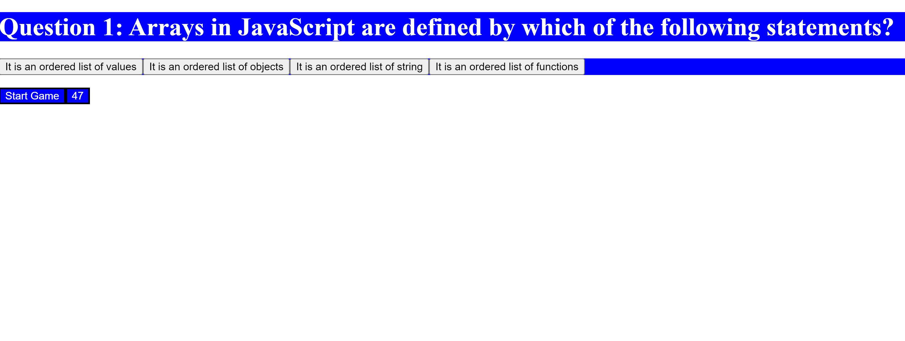

# Timed_Multiple_Choice_Quiz
## Description
We have created the "Javapardy" multiple choice quiz, which includes the following features/functions:
1.  The DOM was manipulated in javascript and all html elements were created in javascript including but not limited to H1, DIV, P, Buttons;
2.  The ten question multiple choice quiz was stored exclusively in a variable object called "multipleChoice," which contained properties of question, the four choices, and the answer;
3.  The DOM was manipulated using "appendChild," "setAttribute," and "textContent."
4.  Three main functions were created to execute the acceptance criteria: (1) an event listener on buttonOne that started the game; (2) a "countdown" function that started the timer; and (3) and quiz loop that looped through the "multipleChoice" object, compared user's answer with actual answers, and deducted three seconds off the clock if incorrect.
5.  An endGame() function and storeScore() function will be created to endGame and input user initials to store locally.
6.  More stylistic elements will be added on resubmit.
## Screenshot

## Link
https://aaloksikand.github.io/Timed_Multiple_Choice_Quiz/